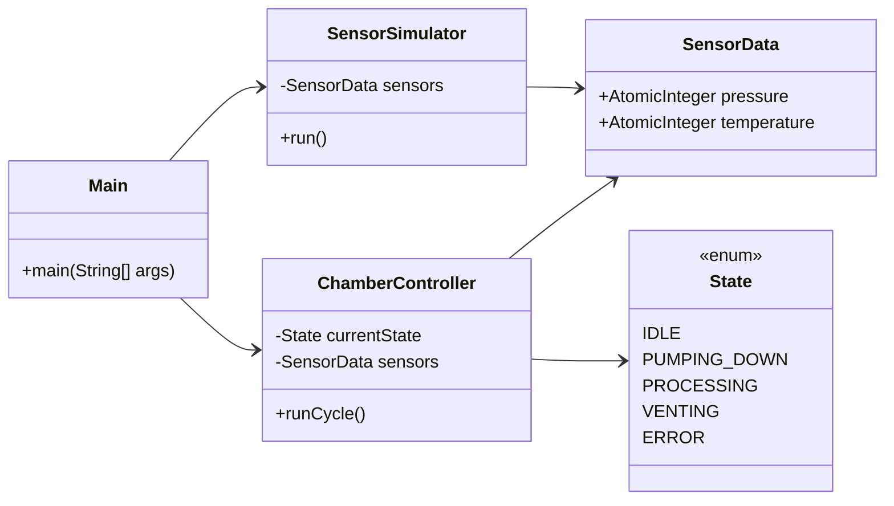
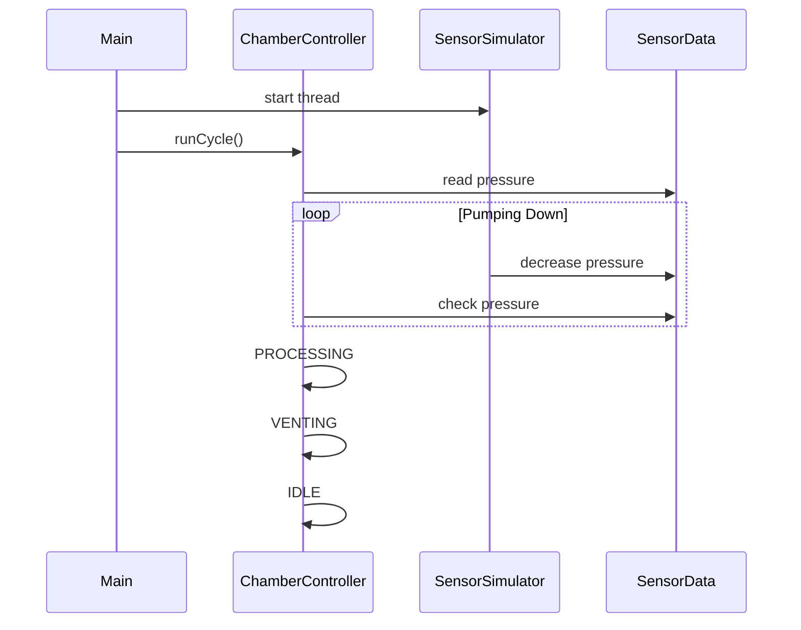
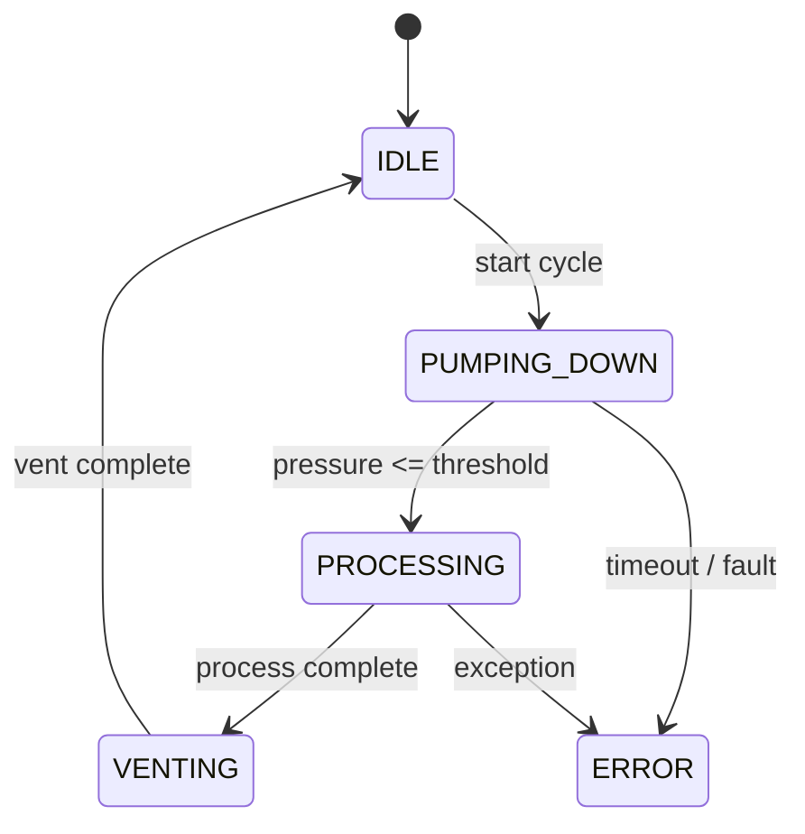

# Semiconductor Chamber Process Simulator

A multithreaded Java simulation of a semiconductor vacuum chamber process,
modeled using real-world equipment control and safety concepts used in
etching and deposition tools.

---

## Overview

This project simulates the lifecycle of a semiconductor process chamber,
including vacuum pump-down, processing, and venting, using:

- A **background sensor simulation thread**
- A **controller-driven finite state machine (FSM)**
- **Shared memory concurrency** with thread-safe primitives
- **Safety interlocks** based on pressure thresholds

The design mirrors how real industrial equipment coordinates hardware
subsystems and software control logic.

---

## Features

- Multithreaded sensor simulation using `Runnable`
- Shared memory using `AtomicInteger`
- Finite State Machine (FSM) for chamber control
- Safety interlock that blocks processing until safe vacuum is reached
- Clear separation of controller logic and sensor behavior
- Deterministic and debuggable state transitions

---

## Architecture

**Core Components:**

- **SensorSimulator (Background task)**  
  Runs as a background thread and continuously updates pressure values.

- **ChamberController (Main Controller)**  
  Manages chamber states and enforces safety conditions before processing and implements a Finite State Machine (FSM).
  - Logic Flow:
     `IDLE` -> `PUMPING_DOWN` -> (Wait for Pressure < 50) -> `PROCESSING` -> `VENTING` -> `IDLE`

- **SensorData (Shared Memory)**  
  Stores critical process variables (Pressure, Temp) using AtomicIntegers for thread safety.

- **State**  
  Enum defining valid chamber states (`IDLE`, `PUMPING_DOWN`, `PROCESSING`, `VENTING`, `ERROR`).

---
## System Architecture (UML)

---

## How It Works

1. The controller starts in the `IDLE` state.
2. The chamber transitions to `PUMPING_DOWN`.
3. The controller continuously checks pressure via a safety interlock.
4. Once pressure reaches a safe threshold, processing begins.
5. After processing, the chamber vents and returns to `IDLE`.

All sensor updates occur asynchronously via a background thread.

---

## Process Flow (Sequence Diagram)

---

## Finite State Machine (FSM)

---

## How to Run

Compile and run Main.java. The console will display interleaved logs from the 
hardware simulator and the control logic.

`OR`
```bash
javac -d out src/ChamberSimulator/*.java
java -cp out ChamberSimulator.Main
```

## Full Console Output
<details> <summary>Click to expand full console output</summary>
  
```text
--- Starting Cycle ---
[SIM] Pressure dropped to: 740
State Transition: IDLE -> PUMPING_DOWN
Pressure is 740. Waiting for vacuum...
[SIM] Pressure dropped to: 720
[SIM] Pressure dropped to: 700
Pressure is 700. Waiting for vacuum...
...
[SIM] Pressure dropped to: 60
Pressure is 60. Waiting for vacuum...
[SIM] Pressure dropped to: 40
[SIM] Pressure dropped to: 20
State Transition: PUMPING_DOWN -> PROCESSING
Plasma ON. Processing wafer...
[SIM] Pressure dropped to: 0
State Transition: PROCESSING -> VENTING
Returning to atmospheric pressure...
State Transition: VENTING -> IDLE
--- Cycle Complete ---
```
